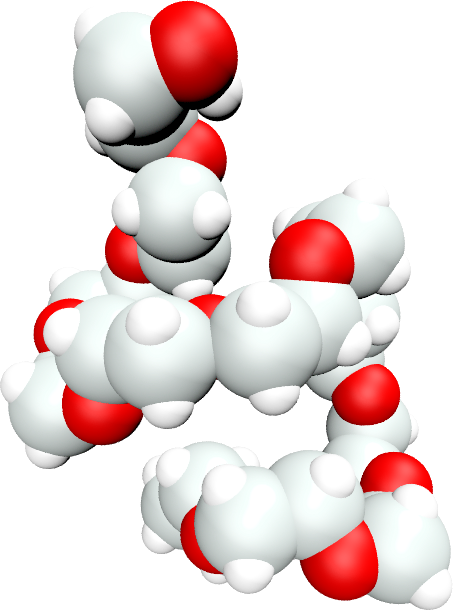

# Generate PEG topology for GROMACS



### Description

Python script for generating a single all-atom PEG molecule with a number Nseg of monomer. The charmm36 force field is used, and the output is readable by GROMACS.

### How to:

Generate the configuration files using generatePEGgromacs.ipynb, or simply by exebuting generatepeg.sh:

```
    sh generatepeg.sh
```
You can vary the number of monomer by changing the value of Nseg. Then, minimise the energy of the PEG using gromacs:

```
    gmx grompp -f input/em.mdp -o em -pp em -po em
    gmx mdrun -v -deffnm em
```
Eventually, relaxe the PEG molecule in the NVT ensemble:
```
    gmx grompp -f input/nvt.mdp -o nvt -pp nvt -po nvt
    gmx mdrun -v -deffnm nvt
```

### Output

Pre-equilibrated [PEG600](PEG600/) and [PEG1200](PEG1200/) topology files are given. This [video](https://www.youtube.com/watch?v=8ldIHP175TI) has been made using the PEG molecule generated with this script.

### Contact

Feel free to contact me by email if you have inquiries. You can find contact details on my [personal page](https://simongravelle.github.io/).
